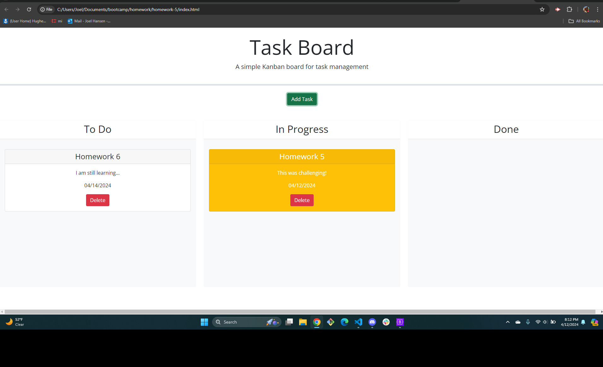

# Title: Kanban Task Board Project

## Description
- This project focused on the creation of a task board application to manage project tasks.  This project uses aspects of bootstrap and features dynamically updated HTML and CSS powered by jQuery.  Users are able to click the "add task" button and are prompted with Modal where they are able to create a new task with title, due date and description.  Once created the tasks are organized by "to do" "progress" and "done."  When task due dates match the current calendar date the card will turn yellow. Day.js was also used in this project.  Tasks can also be dragged back and forth from the above stated lanes.  Once tasks are completed they can be deleted as well.  

This project was completed by Joel Hansen who was provided assistance from cohort classmates, bootcamp tutors and in class notes/lectures.  

## Screenshots

## link to github repo 
[click here](https://github.com/JoelhansenMN/taskboard-assignment)

## link to application
[click here](https://joelhansenmn.github.io/taskboard-assignment/)